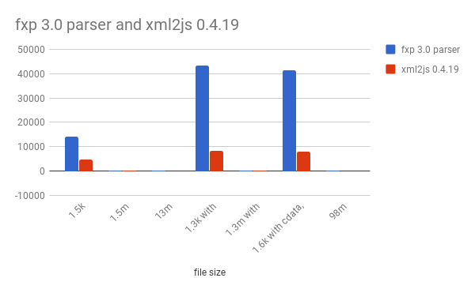

gatsby的插件gatsby-plugin-sitemap生成的文件是xml格式，而baidu要求主动推送是txt文件。  
所以需要把xml转换成txt文件，并且定时向baidu推送。

用[fast-xml-parser](https://www.npmjs.com/package/fast-xml-parser)进行xml解析，其性能是js中最好的。以下是和xml2js的对比：


安装：  
npm i fast-xml-parser

下面是具体实现的代码，将xml中的url解析后存入了site.txt中
```
var fs = require('fs');                                                 
var parser = require('fast-xml-parser');

var xmlData = fs.readFileSync('./public/sitemap.xml');
var txtFile = fs.openSync('./public/site.txt', 'w');

var  dataObj = parser.parse(xmlData.toString());

for (urlInfo of dataObj.urlset.url) {
    console.log(urlInfo.loc);
    fs.writeFileSync(txtFile, urlInfo.loc+'\n');
}

fs.closeSync(txtFile);
```
其中parse接口使用的默认参数，还可以使用options参数添加更多功能，具体解析如下：  
 <font color=blue>attributeNamePrefix</font>: 提供预定的字符串作为属性名称前缀, 比如@\_， 这时假设解析的属性为name，那么在解析后的JSON中该属性将会解析为@_name  
<font color=blue>attrNodeName</font>: 将所有属性分组为给定名称的属性， 取代原本的属性名称， 修改为该名称  
<font color=blue>ignoreAttributes</font>: 忽略解析属性， 配置该项的时候不会解析标签内的属性， 默认为true  
<font color=blue>ignoreNameSpace</font>: 从标记和属性名称中移除命名空间字符串  
<font color=blue>allowBooleanAttributes</font>: 标记可以具有不带任何值的属性  
<font color=blue>parseNodeValue </font>: 将属性的值解析为float、integer或boolean  
<font color=blue>parseAttributeValue</font>: 将属性的值解析为float、integer或boolean  
<font color=blue>trimValues</font>: 修剪属性或节点的字符串值   
<font color=blue>cdataTagName</font>: 如果指定，解析器会将CDATA解析为嵌套标记，而不是将其值添加到父标记中  
<font color=blue>cdataPositionChar</font>: 它将有助于将JSON转换回XML，而不会失去CData的位置   
<font color=blue>parseTrueNumberOnly</font>: 如果为真，则像“+123”或“0123”这样的值不会被解析为数字  
<font color=blue>tagValueProcessor</font>: 转换期间处理标记值。如HTML解码、单词大写等，仅适用于字符串    
<font color=blue>attrValueProcessor</font>: 转换期间处理属性值。如HTML解码、单词大写等，仅适用于字符串    
<font color=blue>stopNodes</font>: 不需要解析的标记名数组。相反，它们的值被解析为字符串。  

参考链接：https://www.jianshu.com/p/d4efd04d43fb
